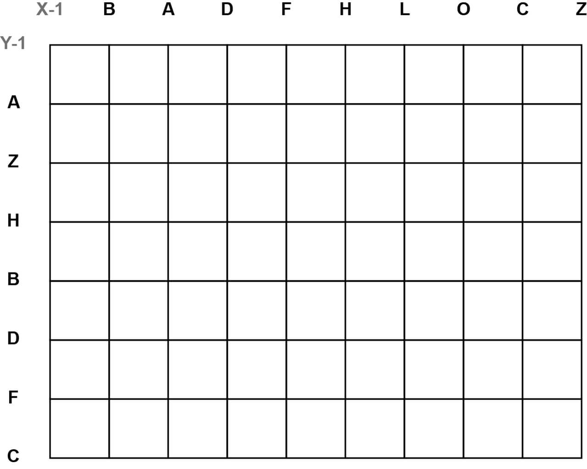
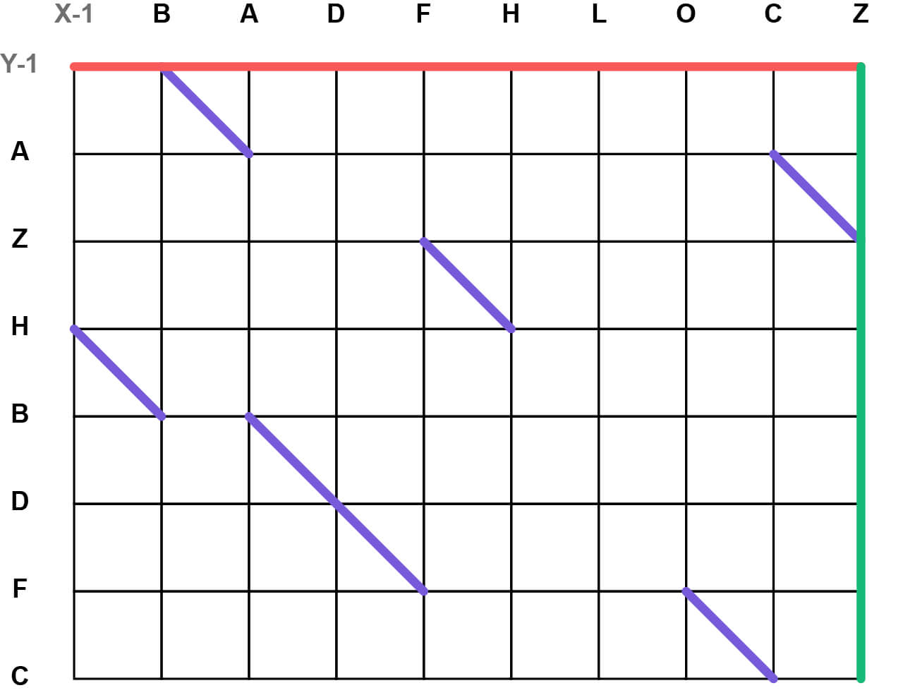
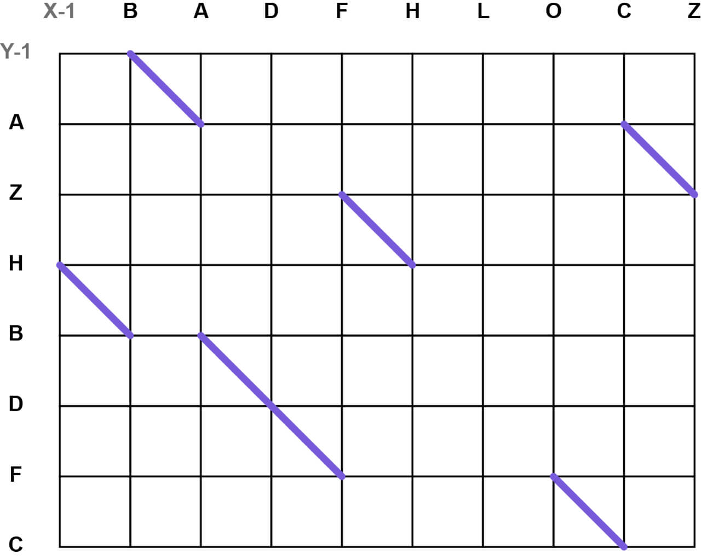
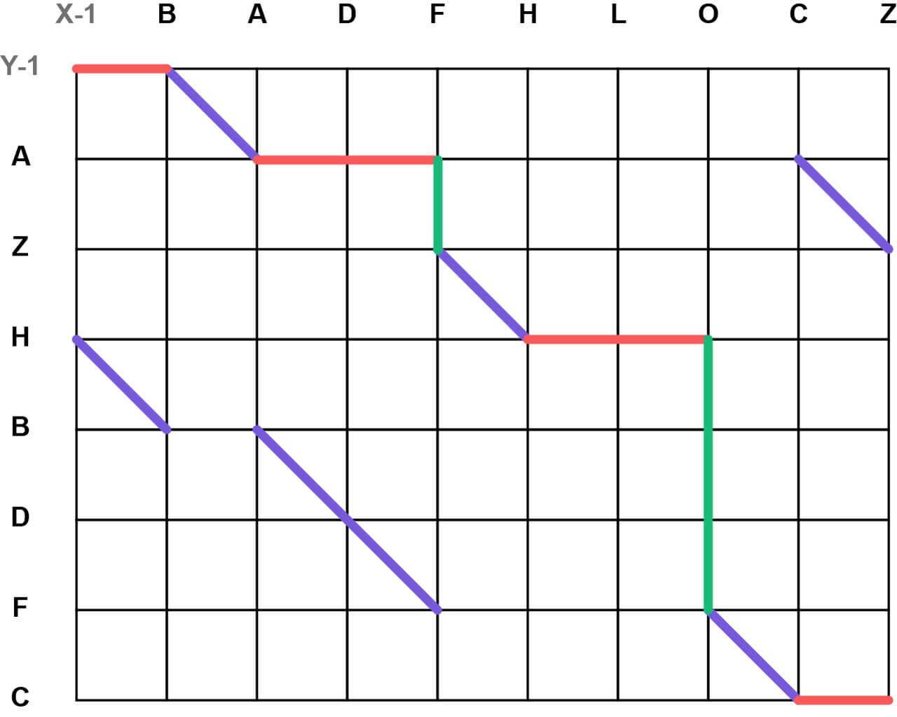
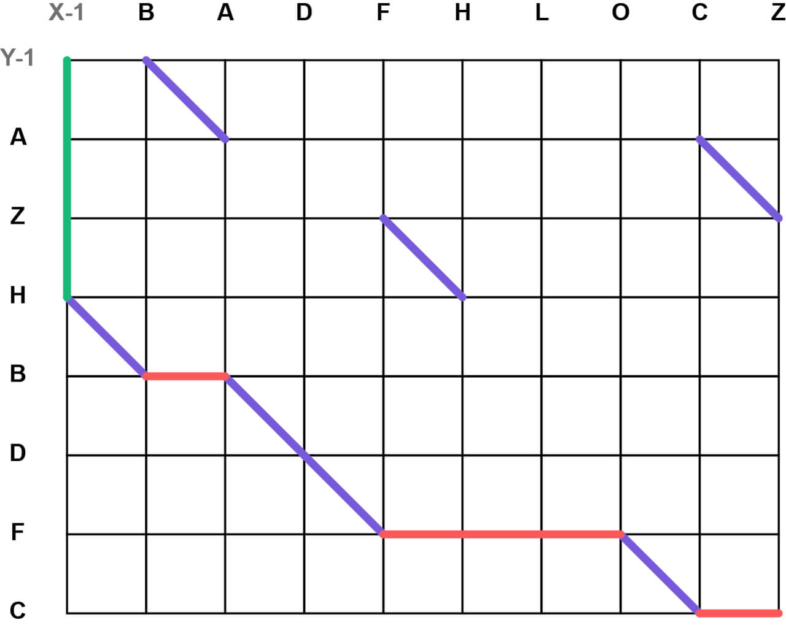

# Eugene W. Myers' Diff Algorithm

The diff algorithm is used to calculate a path to convert one collection to another, referred to as the **"source"** and **"destination"** collections. For the examples in this documentation, we'll use the following source and destination collections:

**Source**: `B A D F H L O C Z`  
**Destination**: `A Z H B D F C`

Any dataset bound by a unique ID can be used. The above character sequences will be used for simplicity.

## The Diff Matrix

### Setup

We start by creating a grid that is the length of the source collection by the length of the destination collection. In this case, the grid would be 9x7 as shown below. The grid will be used for plotting coordinates which we'll eventually interpret as modification operations. The grid starts at `X-1`/`Y-1`, and the source and destination collections are plotted from `X0` and `Y0` respectively, as shown below.

-----

### Modification Operations

Using the grid we set up previously, we use a series of horizontal, vertical, and diagonal lines to work our way from the top left corner, to the bottom right corner, referred to as the **"start"** and **"finish"** respectively. Horizontal lines represent a removal from the source collection, whereas vertical lines represent insertions into the source collection from the destination collection. The index used for the operation is determined using the coordinates of the operation; removals use the `X` coordinate, and insertions use the `Y` coordinate.

The simplest way to convert the source collection to the destination collection is to remove everything from the source, then insert everything from the destination (or vice versa). This is however, not always the shortest possible path between the two, which is where we make use of diagonal movements.

-----

### Diagonals

Items that exist in both the source and destination collections are represented by diagonal lines. Diagonals shorten the path because the item does not need to be removed nor inserted.

-----

### Finding the Shortest Possible Path

The shortest possible path is the one that uses as many diagonals as possible however, not all diagonals are within range of each other since we can only move forwards going from start to finish. Depending on the collections, multiple shorter paths may also be available. To calculate the shortest possible path, we calculate the longest common subsequence.

  

