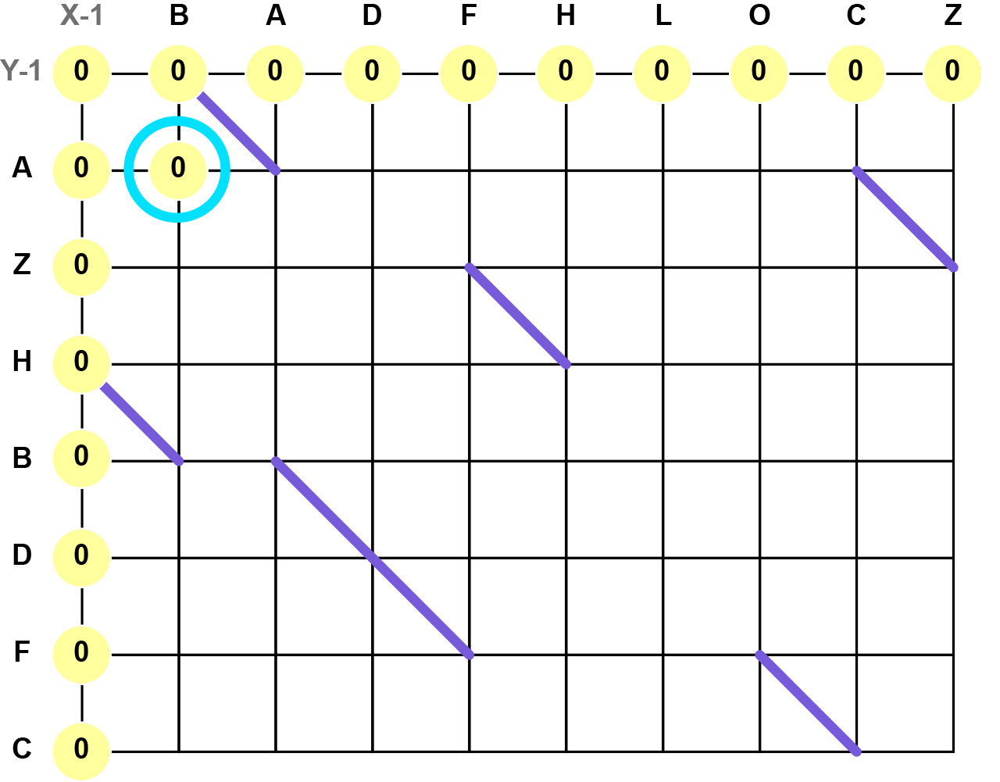
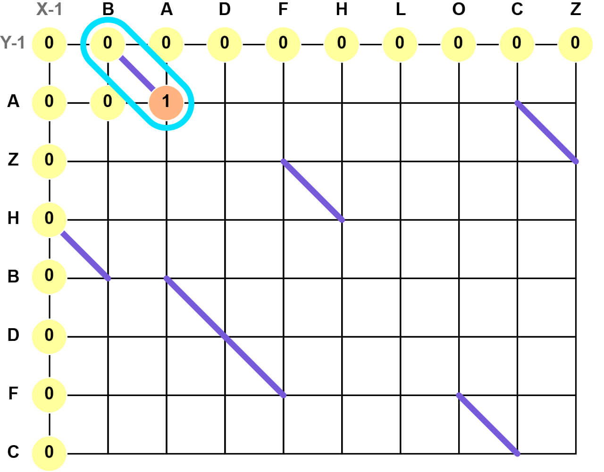
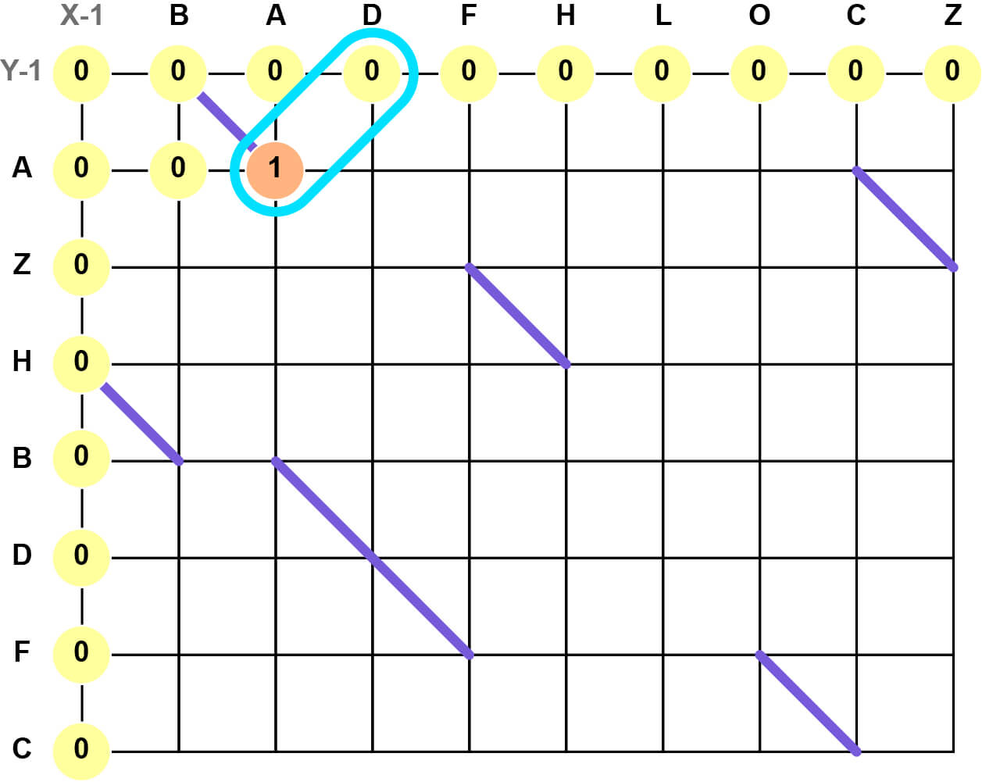

# Longest Common Subsequence

After finding the locations of all diagonals in the diff matrix, we use the longest common subsequence method to find the shortest path from start to finish. This involves traversing the matrix and keeping a score for how many diagonals can reach the current coordinate. With all diagonals plotted, we'll start by giving a score of `0` at `X-1` and `Y-1` positions.

-----

## Working Through the Matrix

Starting at `X0`/`Y0`, we'll work from left to right and top to bottom, querying each coordinate and scoring accordinaly.

### 1) The Coordinate isn't at the Bottom of a Diagonal

Here, we're querying `X0`/`Y0`. This coordinate **isn't** located at the bottom/end of a diagonal, therefore its score is the maximum value between the coordinate to the left and the coordinate above (in this case, `X-1`/`Y0` and `X0`/`Y-1`). Since both of these coordinates' scores are `0`, the current coordinate receives a score of `0`, too.

-----

### 2) The Coordinate is at the Bottom of a Diagonal

Now, we're querying `X1`/`Y0`. This coordinate **is** located at the bottom/end of a diagonal. In this case, the coordinate's score is the value at the top/start of the diagonal plus 1. The coordinate at the top/start of the diagonal is `0`, therefore we give the current coordinate a score of `1`.

-----

### 3) Continue the Pattern

The two rules above are applied to the rest of the coordinates within the matrix until we reach the end. The value at the end of the matrix is the length of the longest common subsequence, and tells us how many diagonals we can take to form the shortest possible path. In this case, the length of the longest common subsequence is `4`.

  

-----

## Building the Path

With the length of the longest common subsequence, we can begin to work backwards from the end of the matrix to the beginning. When traversing backwards, we can only move left and upwards until we reach the boundary of the current score group (illustrated as separate colors below). We can move into the next score group when we reach the bottom of a diagonal, then the process is repeated until we reach the beginning.

The path taken between the end of the matrix, the diagonals found via the longest common subsequence, and the beginning of the matrix, will be the shortest path to take to convert the source collection to the destination collection. In our example, there are two routes with equal length; either will suffice.

 

When we interpret the steps taken to get back to the beginning as horizontal and vertical movements, we get a completed diff matrix that follows the shortest possible path between the source collection and the destination collection.

 
