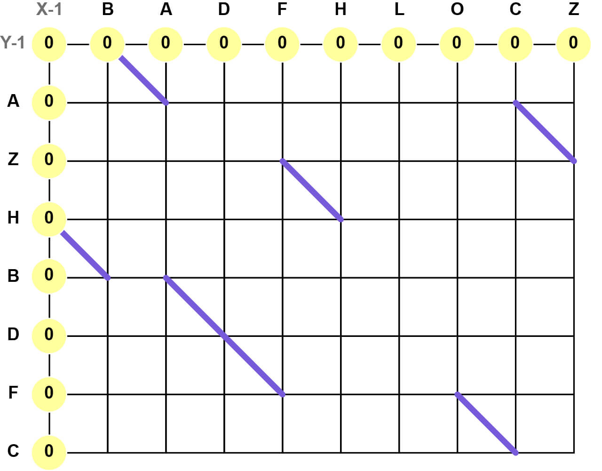

# Longest Common Subsequence

After finding the locations of all diagonals in the diff matrix, we use the longest common subsequence method to find the shortest path from start to finish. This involves traversing the matrix and keeping a score for how many diagonals can reach the current coordinate. With all diagonals plotted, we'll start by giving a score of `0` at `X-1` and `Y-1` positions.

