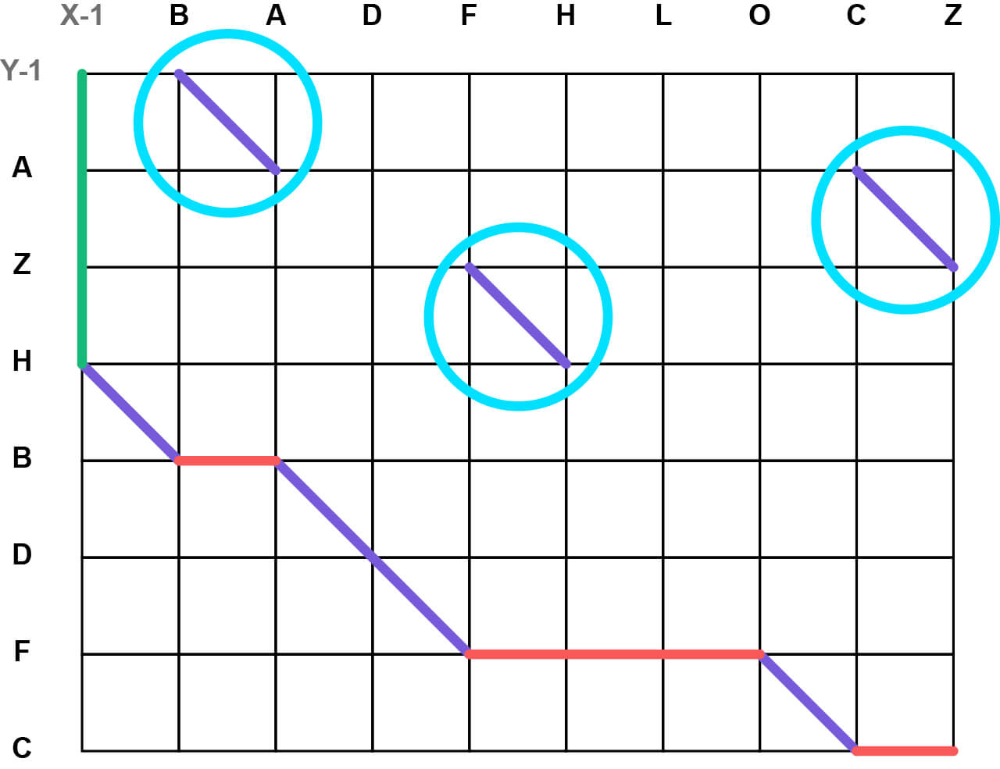
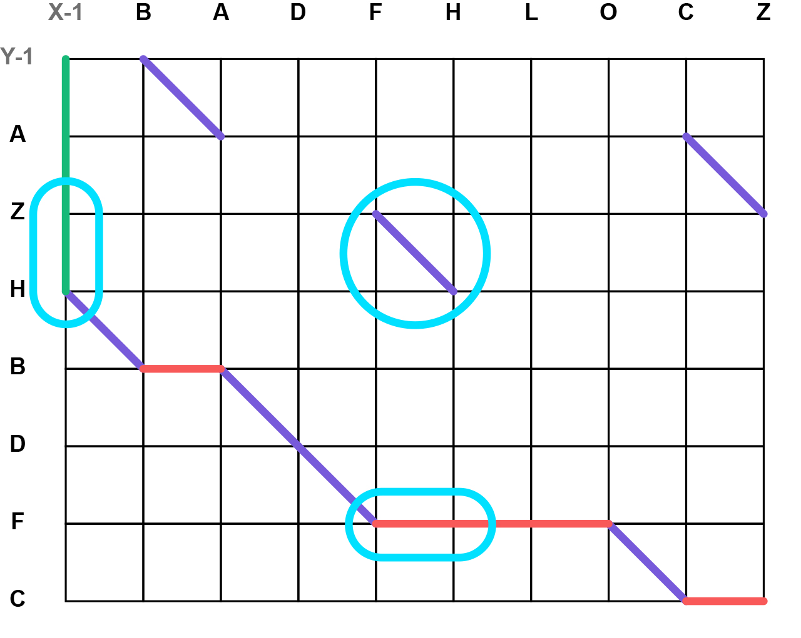

# Detecting Moves

**"Moves"** describe the concept of an item that is persistant between the source and destination collections, but its position has changed. This is a concept that the diff algorithm we've used so far does not take into account thus, an extra layer had to be built. If items are arranged such that moves would never be necessary, move detection can be disabled (for example: entries ordered by date) to increase performance.

## Finding Move Operations

The number of move operations is equal to the number of diagonals within the diff matrix that **are not** included within the path. Since they're not included in the path, they will instead be interpreted as an insert/remove operation followed by the inverse later in the sequence. We can use these diagonals to know how many moves have to be found and use the `X`/`Y` coordinates of the diagonal to find them.

 

## Updating the Operation Payload

When a move operation has been found, its payload requires two changes: the move flag adding (see [Operation Payloads](3%20-%20Operation%20Payloads.md)), and the `X`/`Y` coordinate swapping for the opposite.

### Swapping the Operation's Coordinate

When we eventually process the modifications and dispatch them to a data source, we keep track of the `X`/`Y` coordinates as we move through the path. This means that, for regular remove/insert operations, we know the respective `X`/`Y` coordinates without having to decode them from the operation payload. However, with this approach, `X` is only ever guaranteed to be accurate for remove operations, and `Y` is only ever guaranteed to be accurate for insert operations and as such, only one value can be trusted when processing an operation with the move flag.

When handling the first of the two move operations, we create a postponed operation that will be queried later. This postponed operation requires both the `X` and `Y` coordinates in order to be queried accurately; this is why we swap the operation's coordinates.

The remove/insert flag on the operation tells us which coordinate can be trusted when working through the path (`X` for remove operations, `Y` for insert operations). Swapping the operation's coordinates gives us the missing coordinate, so:

* Remove operations with the move flag will contain the `Y` coordinate.
* Insert operations with the move flag will contain the `X` coordinate.

For example: compare the different payloads for the remove/insert operations outlined in the image above:

| | `X` | `Y` |
| --- | --- | --- |
| Move detection enabled | `38`/`00100110` (insert, move, coordinate: 2) | `69`/`01000101` (remove, move, coordinate: 4) |
| Move detection disabled | `66`/`01000010` (remove, coordinate: 4) | `33`/`00100001` (insert, coordinate: 2) |
