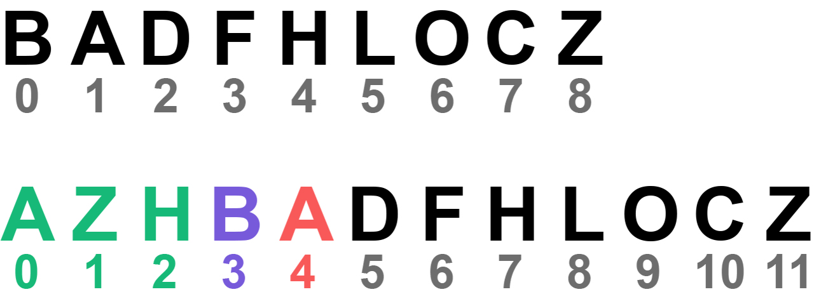

# Dispatching Modification Operations

The modification operations contained within the path are dispatched to a .NET collection via an update callback. This is a wrapper that takes the instructions from the operation and applies them to a .NET collection. When the updates are dispatched, we move from `X-1`/`Y-1` in the diff matrix to the end, via the path provided. DifferenceUtility.Net calculates all required offsets so that all indexes are correct when they reach the update callback.

## Offsets

The relationship between operations and the X offset and Y offset is circular. This means that operations require offsetting before they're processed, and they may create an offset after being processed. Here, we'll explain how each offset is applied and created, followed by how the operations are handled afterwards.

### X Offset

An `X` offset is required whenever the data source is modified, or the operation's intent is to modify using the `X` coordinate. Below is an example of modifying the data source. The top row shows the source collection with its original items at original indexes however, as soon as we process the first operation in the path by inserting at `Y0`, the indexes of the orignal data increase. Handling this operation will create an `X` offset at index `0` with a value of `1`, likewise for the next two operations with their respective `Y` positions.

 &ensp; &ensp; &ensp; 

The fourth operation in the path may require us to update the contents of the item at the current coordinates: `X0`/`Y3` (referring to the letter `B`), but we can see that `X0` in the source collection isn't the same as `X0` in the data source being modified. This is where we apply the `X` offset. In this context, `Y3` refers to the destination collection and therefore does not need offsetting. We take the provided `X` value and check whether there are any offsets with a position less than or equal to it. If one is found, we apply the offset and then search the offsets again from the beginning, not including any offsets that were applied previously, and using the adjusted `X` value instead of the original. This is repeated until no further offsets can be applied. Based on these rules, `X0` becomes `X3`,  which lines up correctly with the target item.

The fifth operation tells us to remove at `X1` (referring to the letter `A`). First, we apply the `X` offset, which gives us `X4`, then we remove the item using the adjusted `X` value, and finally we create a new `X` offset at index `4` with a value of `-1` (because an item was removed rather than inserted).

This is the result after applying all `X` offsets for the entire sequence:

-----

## Operation Handling Breakdown

### Updates

Operations with the update flag require both an `X` and `Y` coordinate. As such, it will only ever be found on diagonal operations and moves. The `X` coordinate requires offsetting to give us the correct position of the item in the data source being modified. The `Y` coordinate does not require offsetting in this case, as this coordinate refers to the position in the destination collection which isn't being modified. With both values, the changes are pushed to the existing item from the new item.

### Moves

If we encounter a remove/insert operation with the move flag, we first decode either the `X` or `Y` coordinate from the payload (depending on the operation type), then check to see if a postponed operation exists with these coordinates. If it does, we first apply an offset to the `X` coordinate, followed by an offset to the `Y` coordinate. If the operation also has the update flag, we handle this as described above before moving the item from the adjusted `X` coordinate, to the adjusted `Y` coordinate. If however, a postponed operation does not already exist, we create one using the unmodified `X` and `Y` coordinates and move onto the next operation in the path.

### Removals (without move flag)

To handle a regular remove operation, we simply offset the current `X` coordinate and use this to remove the item.

### Insertions (without move flag)

Handling a regular insert operation is handled slightly differently depending on whether move detection is enabled. If move detection **is** enabled, the current `Y` coordinate requires offsetting. This offset **isn't** required if move detection is disabled. In both cases, the item being inserted is acquired at the `Y` position in the destination collection, and inserted at either the adjusted, or normal, `Y` position in the data source being modified.
